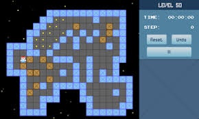
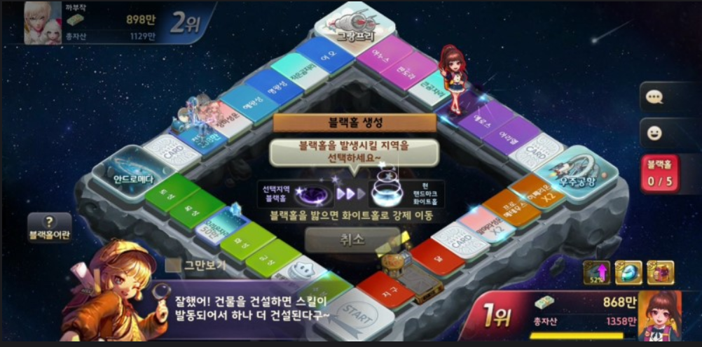
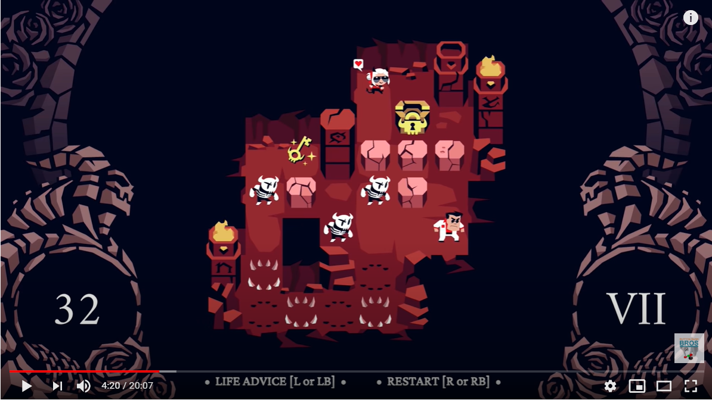
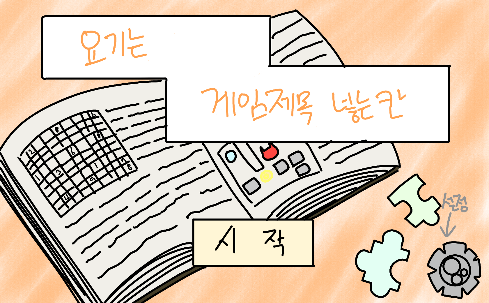
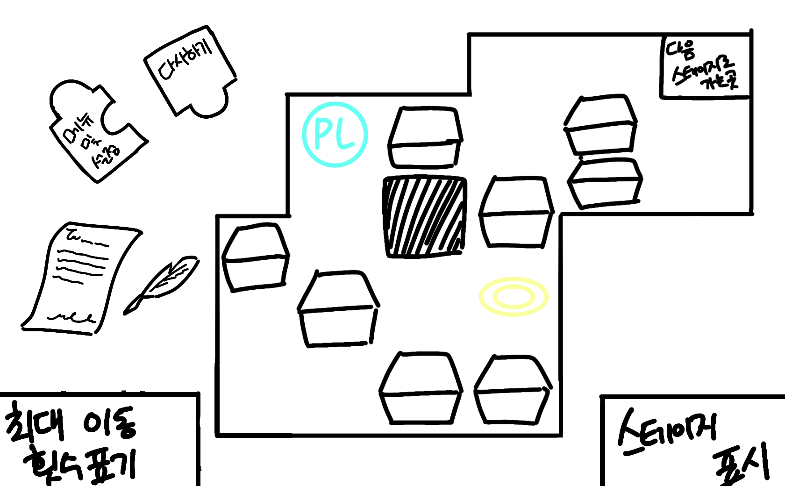
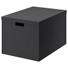
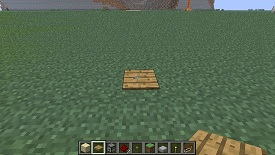
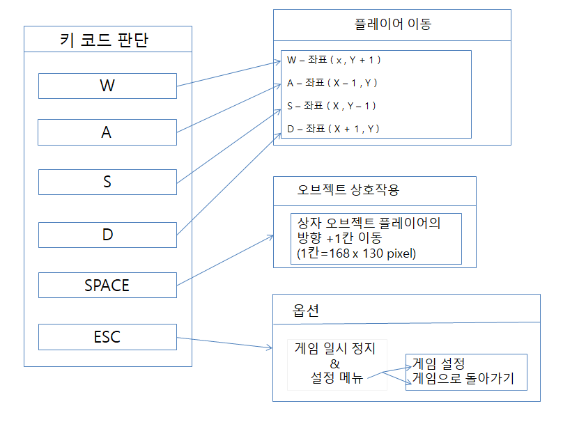
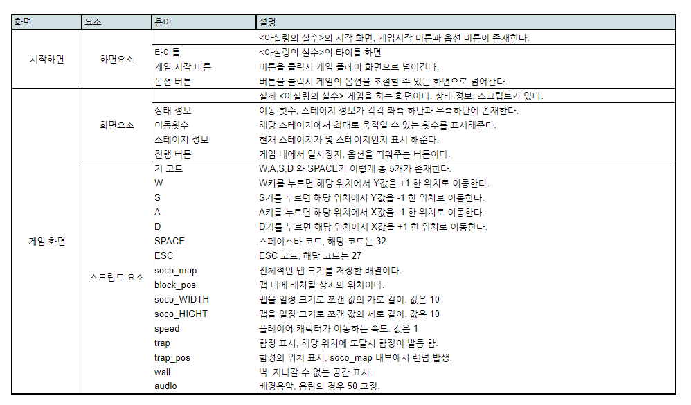
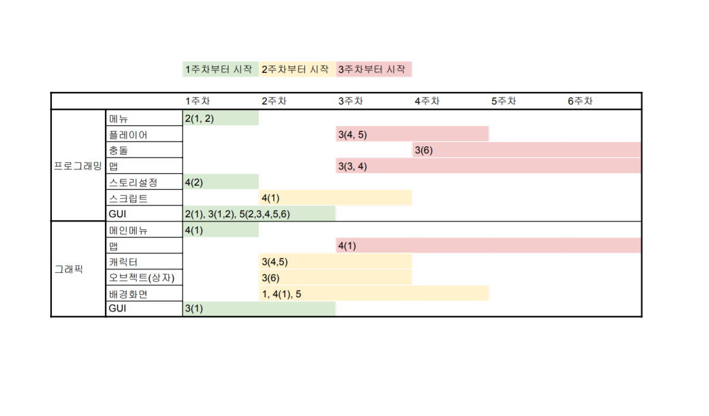

# 아실링의 실수 - 박예솔 & 이지수

> <목차>  

1. [게임명: 아실링의 실수](#아실링의-실수--박예솔--이지수)

2. [컨셉](#컨셉)

3. [관련이미지 & 동영상](#관련-동영상--이미지)

4. [대표이미지](#대표이미지)

5. [컨셉 & 대표이미지 기반 작품묘사](#컨셉--대표이미지-기반-작품묘사)

6. [아실링의 실수 구성요소](#게임-구성요소)

7. [게임 시스템 디자인](#게임-시스템-디자인)  
    - [a. 게임 오브젝트 분해](#구성-요소-분석)  
    - [b. 파라미터(속성)](#파라미터-뽑기)  
    - [c. 행동](#행동-뽑아보기)  
    - [d. 상태](#상태-뽑아-보기)  
    - [e. 플레이어 캐릭터 속성(파라미터)](#플레이어-캐릭터-속성파라미터)  
    - [f. 게임의 규칙](#게임의-규칙)  
    - [g. 게임에서 사용될 공식](#게임에서-사용될-공식) 

8. [개발 요구사항 & 흐름도](#요구사항--흐름도)    
    - [a. 요구사항(1년)](#1년-기준)
    - [b. 요구사항(6주)](#6주-기준)
    - [c. 키보드 이벤트에 대한 흐름도](#키보드-이벤트에-대한-흐름도)
    - [d. 용어 정리](#용어-정리)

9. [스토리 보드(비선택)](#용어-정리) 

10. [개발 작업 일정(6주)](#개발-작업-일정6주)

11. 주차별 동영상  
- [1주차 영상과 작업 결과](https://hawasu.github.io/files/1주차.html
 "이것은 1주차 영상입니다.")   
- [2주차 영상과 작업 결과 ](https://hawasu.github.io/files/2주차.html
 "이것은 2주차 영상입니다.") 
- [3주차 영상과 작업 결과 ](https://hawasu.github.io/files/3주차.html
 "이것은 3주차 영상입니다.") 
- [4주차 영상과 작업 결과 ](https://hawasu.github.io/files/4주차.html
 "이것은 4주차 영상입니다.") 

  

# [컨셉]

## 메인 컨셉 
> 성취감
- 스테이지 클리어의 목표를 달성하는 것이 목적이다.
- 1인 플레이어 중점.
- 플레이어가 목표 달성 행위 자체에 흥미를 느끼게 함.

 

### 서브 컨셉 1 
> 패턴(반복성)
- 패턴은 퍼즐게임의 특성상 연출의 큰 틀이 된다.
- 일정한 반복은 게임의 정체성을 확립하기에 도움을 준다.

 

### 서브 컨셉 2 
> 규칙성
- 불규칙하거나, 규칙적인 진행 방식으로 반복적인 게임의 지루함을 방지한다.
- 퍼즐 게임의 규칙은 플레이의 가장 큰 도움이 된다.

 

### 서브 컨셉 3 
> 집중력
- 복잡한 퍼즐게임 특성상 문제 해결을 위한 집중력이 발휘되도록 함.
- 흥미를 이끌어내어 게임의 집중을 돕도록 한다.

 

### 서브 컨셉 4 
> 전략적
- 플레이어 스스로 원활한 게임진행을 위해 전략을 세워야 한다.
- 플레이어가 헤메일 수 있도록 경우의 수를 두며 제작해야 함.

 

### 서브 컨셉 5 
> 단계성
- 스테이지의 클리어를 조건으로 레벨을 측정한다.
- 스테이지의 클리어로 플레이어 캐릭터의 업그레이드를 도와준다.

  

# 관련 동영상 & 이미지
>소코반 형식의 게임으로 장애물과 목표지점 플레이어의 움직임을 대표합니다.

가장 대중적인 소코반 형식입니다.

모두의 마블에서 밟으면 이벤트가 발동하는 부분을 따올겁니다.

캐릭터가 일정 바닥을 밟으면 다른 퍼즐게임을 미니게임 형식으로 화면에 띄어 플레이 하도록 하는 방식입니다.

소코반 이용 게임 헬테이커입니다. 함정 기능과 장애물, 오브젝트의 움직임 등 대부분의 예시가 들어가 있습니다.

  

# [대표이미지]
## 시작 화면
>시작 화면 세부 설명

- 퍼즐게임인 만큼, 타이틀에 ‘스도쿠 퍼즐’과 ‘직소 퍼즐’의 조각을 배치해 퍼즐게임 임을 암시

- 크게 게임 제목과 가운데 아래에 시작 버튼을 배치.

- 또한 게임 내부 설정을 바꿀 수 있도록 설정 버튼 배치.

  

## 플레이 화면
>플레이 화면 세부 설명

- 플레이엔 화면 전체가 아닌 부분적인 맵 사용

- 나머지 빈 공간은 게임의 컨셉/스토리에 맞게 디자인 예정

- 왼쪽 아래에는 최대 이동횟수 표시, 오른쪽아래에는 해당 스테이지 표시

- 왼쪽 위에 ‘메뉴 및 설정 버튼’과 해당 스테이지를 다시 할 수 있는 ‘다시하기 버튼’ 배치

  

# [컨셉 & 대표이미지 기반 작품묘사]

## 스토리- 도입

도서관에서 책을 하나 꺼내 읽음 -> 빛무리가 플레이어를 감싸서 차원의 틈으로 데려감 -> 차원의 틈에서 여러 동화들이 엉망이 된게 보임 -> 작은 빛이 와서 동화가 엉망이 됐으니 도와달라고 불렀다라고 설명 -> 플레이어가 어이없어하다가도 도와주면 집으로 보내준다는 말에 도와준다함 -> 플레이어는 소코반 형식의 퍼즐과 미니게임(스토쿠 / 로직 / 2048 / 물건 맞추등기) 함정을 해결하며 스테이지를 넘어가 스토리를 진행 함 -> 동화의 결말을 완성시켜 혼란을 잠재우게 됨.

- 혼란을 잠재울 조건: 스테이지 클리어로 인한 진행
- 플레이어가 참여하게 된 이유: 집으로 돌아가고 싶어서
 

>[스테이지]

기준: 동화 한권 -> 월드 하나
설정: 월드 안에 n개의 스테이지가 존재. 스테이지를 모두 클리어 할 시 동화(월드)의 엉망이었던 설정들이 기존에 우리가 알던 이야기로 되돌아옴

## 작품 묘사

---{시작 화면}

도서관에 있는 책을 펼친 모습

---{플레이 화면}

주인공의 상황 - 도서관에서 책을 읽다, 신비로운 힘에 의해 동화속 차원으로 넘어가게 됨.

적 - 플레이어와 싸우는 적 대신, 플레이어의 진행을 방해하는 장애물 또는 함정이 있음. 

배경 - 도서관에 있는 동화책에 흘려들어가게 되어 시공간에 갇힌 상황
 
---{UI 설명}

최대이동횟수표기 - 플레이어가 이동가능 한 횟수, 전부 소진될 시 패널티 부여 혹은 해당 스테이지 다시 시작

스테이지 표기 - 현재 스테이지

다음 스테이지로 가는 곳 - 도달해야 할 목표지점 

함정구간 - 미니게임 발동, 목표지점에 도달하기 위해 무조건 적으로 밟을 수 있게 설치

박스 - 퍼즐을 풀기위한 오브젝트

다시하기, 메뉴 및 설정 - 설정 화면과 다시 시작할 수 있는 버튼

벽 - 통행불가, 장애물

플레이어 - 플레이어

[컨셉 기반 작품 묘사]

> (플레이어의 게임 진행 방식)

플레이어의 전체적인 맵 확인(전략적, 집중력) -> 퍼즐 풀이 후 화살표 키로 이동 -> 바로 앞, 옆, 뒤에 있는 박스를 옮기면서 나아감(규칙적) -> 함정 구간에서 미니게임 해결(성취감) -> 목표 지점 도착(단계상, 성취감) -> 이와 같은 플레이 스토리 완결까지 반복(패턴)
 

+현재 스토리 수정 중으로 추후 변경의 가능성이 있습니다.

  

# [게임 구성요소]
## 메커니즘
> 도전과제

- 책 속을 빠져나가기 위해 퍼즐을 풀기

> 재미요소

- 함정 구간에서 다른 종류의 미니 퍼즐 게임이 실행된다.   
(소코반, 2048, 노노그램 등)
- 매번 다른 구조의 퍼즐이 생성된다.

## 이야기
> 큰 배경으로 도서관이 등장하고 도서관 속의 동화책으로 흘러 들어가 탈출하는 스토리를 잡았습니다.
동화 속의 교훈을 중시하는 것 보다는 무사히 플레이어가 빠져나가기 위한 방향으로 갑니다.

{스토리- 진행 설명}
- 플레이어는 소코반 형식의 퍼즐과 미니게임(스토쿠 / 로직 / 2048 / 물건 맞추기 등) 함정을 해결하며 스테이지를 넘어가 스토리를 진행함
- 스토리를 매번 진행하는 것이 아니라 특정 스테이지에 함정과 함께 컷 씬이 존재하여 스토리의 진행을 보여준다.
- 동화는 최대 2개를 잡았다. (백설공주, 잭과 콩나무)
- 동화 스토리 하나를 끝내면 요정(도우미 NPC)을 이용해 다음 동화로 넘어감

 
{부가 설명}

- 요정: 동화를 관리하는 관리자(동화의 흐름을 감시), 동화가 서로 충돌을 일으켜서 일부 내용의 손실 및 변형이 일어남. 혼자 수습이 되지 않아서 주인공을 불러들임.
- 혼란을 잠재울 조건: 스테이지 클리어로 인한 진행
- 플레이어가 참여하게 된 이유: 집으로 돌아가고 싶어서

## 미적 요소
> 1) 디자인

- 기본적으로 동화 내부에 있는 대표적인함 물건들과 창작 요소가 가미된 물건들을 사용하여 동화 같은 느낌과 몽환적인 느낌이 같이 올 수 있도록 디자인 

> 2) 컬러

- 플레이어 - 회색 빛의 색감 (이유: 동화세계와는 다른 세계의 사람이기 때문)
- 그 외의 색감 - 파스텔 톤의 색감. (동화세계 표현)

>3) 음향

- 게임 BGM 전체 통일 :　같은 배경임을 보여줌,
- 플레이어의 움직임 > 숲임을 암시하는 흙 밟는 소리, 동적 느낌을 줌
- 도달 상황 효과음 넣기(함정, 목표지점) > 클리어 축하를 보여줌. 작은 폭죽 OR 박수 소리
- 상자 배치 시 > 물체 끌리는 소리

  

# [게임 시스템 디자인]

## 구성 요소 분석

|오브젝트 번호|오브젝트 이름|오브젝트 이미지|  
| :--------:|:--------:|:--------:|
|1|주인공||
|2|요정||
|3|상자||
|4|함정||
|5|포탈(목표 지점)||
|6|맵||

  

## 파라미터 뽑기

> 주인공  

|속성|속성 값|설명|비고|  
| :--------:|:--------:|:--------:|:---------:|
|이름|주인공|-|-|
|나이|18|-|-|
|이동 속도| 1.0f | 이동 속력|-|
|체력|이동 횟수(n)| 이동 횟수를 체력으로 치환 함정에 걸리거나 이동할때마다 차감(n -= 1)|-|

 

> 요정  

|속성|속성 값|설명|비고|  
| :--------:|:--------:|:--------:|:---------:|
|이름|아실링|-|-|
|방향성| 길잡이(도우미)| 플레이어의 수월한 스토리 진행을 위한 길잡이 역할|-|

 

> 상자  

|속성|속성 값|설명|비고|  
| :--------:|:--------:|:--------:|:---------:|  
|이동 거리| 1칸(168 x 130 pixel)| 피격시 밀려남|-|
|이동 속도| 1.0f | 밀려날 때의 속력|-|

 

> 함정 

|속성|속성 값|설명|비고|  
| :--------:|:--------:|:--------:|:---------:|
|체력|이동 횟수(n)|함정에 걸릴시 기본 이동횟수 차감 (n -= 1)|-|
|종료| Stage Fail| 함정 속 미니게임 실패 시,  해당 라운드 통과 실패|-|

 

> 포탈  

|속성|속성 값|설명|비고|  
| :--------:|:--------:|:--------:|:---------:|  
|목표|Stage Clear| 현 스테이지 클리어 완료  다음 스테이지로 넘어감|다음 스테이지 난이도 상승|

 

> 맵 

|속성|속성 값|설명|비고|  
| :--------:|:--------:|:--------:|:---------:|
|크기|1680 x 1040 pixel| 게임 내 전체 화면 크기|-|

  

## 행동 뽑아보기

> 주인공

|행동|설명|  
|:--------:|:------------:|
|걷기| 플레이어가 상하좌우를 1.0f 의 속력으로 1칸(168 x 130 pixel)씩 이동|
|밀기| 플레이어의 걷기 행동과 같이 작동되며 접촉되는 상자 오브젝트를 1칸씩 행동되는 방향으로 이동하게 함 |

 

> 요정

|행동|설명|  
|:--------:|:------------:|
|대화| 힌트를 위해 플레이어에게 말걸기 & 스토리 및 동화에 대한 정보 설명|

  

## 상태 뽑아 보기

> 주인공

|현상태|전이상태|전이조건|  
|:-------:|:------------:|:----------:|
|정지|걷기|플레이어의 상하좌우 키보드 조작(W, A, S, D)|
|정지|밀기|주인공 상하좌우 1칸 이내에 상자의 존재 확인 후 플레이어의 키보드 조작(Ctrl)|

 

>요정

|현상태|전이상태|전이조건|  
|:-------:|:------------:|:----------:|
|등장|대화|플레이어의 현 스토리 클리어|
|대화|퇴장|플레이어의 다음 스토리 진행 시작|

  

## 플레이어 캐릭터 속성(파라미터)

 

|속성|영문명칭|설명|비고|  
|:---------------:|:--------:|:-------:|:--------:|
|체력|Num|플레이어의 최대 이동 횟수  플레이어의 모든 행동에 대해 1씩 차감되며 0이 되면 Stage Fail   0이 되기 전에 PT에 도달하면 Stage Clear|-| 
|이동 거리|P| 플레이어와 상자의 이동 거리  플레이어와 상자의 모든 행동 관련 이동 거리 동일|-|
|이동 속도|S|플레이어와 상자의 이동 속력  플레이어와 상자의 모든 행동 관련 이동 속력 동일|-|
|목표|PT|플레이어의 목표 도달점 위치  요정의 등장 조건으로 도달 시에만 요정의 반응이 일어남   다음 스테이지로 Sceen 넘김|-|

  

## 게임의 규칙

> 핵심 규칙  
1. 클리어 조건으로 정해진 방법 이외의 방법은 없다.
2. 플레이어는 필수적으로 함정을 지나가야만 한다.

> 보조 규칙
1. 치트 금지
2. 플레이어는 시작 지점에서 뒤로 이동 불가능.

  

## 게임에서 사용될 공식

1. 이동횟수(n) > 0
- 플레이어의 모든 행동 시, n -= 1
- 목표지점 도달 시, Stage Clear

2. 이동횟수(n) = 0
- Stage Fail 및 다시 시작

  

# [요구사항 & 흐름도] 

## (1년 기준) 

#### - 1. 시작화면, 게임화면, 스토리화면, 엔딩화면 총 4개의 화면으로 구성된다.

#### - 2. 시작화면
- 시작화면에는 시작하기, 종료하기, 옵션 버튼이 들어간다.
- 시작하기 버튼은 중앙 하단에 위치하며 종료하기 버튼은 
시작하기 버튼 아래에 위치한다. 
- 옵션 버튼은 우측 상단에 들어간다.
 

#### - 3. 게임화면
- 게임화면에서 다시하기 버튼, 옵션 버튼, 체력 ui, 현재 스테이지 ui가 표시된다. 
- 다시하기 버튼과 옵션 버튼은 좌측 상단에 위치, 체력 ui는 좌측 하단에 위치, 현재 스테이지 ui는 우측 하단에 위치한다.
- 주어진 맵 크기에 미리 정해둔 위치에 블록을 생성해준다.
- 동화마다 레벨이 정해져 퍼즐의 난이도가 상승하나 따로 ui 표시는 하지 않는다.
- 스테이지 클리어 조건은 캐릭터가 포탈에 도달하는 것이다.
- 조작은 키보드(WASD)로 캐릭터의 동서남북 방향과 걷기 동작을 구현한다. 
- 키보드(SPACEBAR)로 상자 오브젝트에 대한 행동을 구현한다.
- 맵 구현 리메이크  
::타일을 이용한 맵 구현 -> 오브젝트를 이용한 맵 구현 

 

#### - 4. 스토리화면
- 스토리 화면은 초반, 중후반으로 나뉜다.
- 모든 스토리 화면에 우측 하단에는 skip버튼이 표시된다.
- skip 버튼으로 텍스트와 이미지를 넘길 수 있다.
- 스토리 초반에 개별 UI와 그 안에 텍스트가 나타난다.
- 이미지 화면은 전체적으로 스토리가 진행되면서 스크립트 형식으로 나온다. 
- 스토리 중반 동화의 마지막 스테이지 클리어 후 수정된 동화의 이야기를 정리하는 화면이 나타난다.
- 이야기 정리 화면은 게임화면 전체를 쓰지 않고 가로X세로 각각 0.5배의 크기를 가진다. 
- 동화는 3가지 이고 동화 한 편당 스테이지는 총 4개이다.
 

#### - 5. 엔딩화면
- 엔딩화면의 게임오버, 탈출로 나뉜다.
- 게임 오버 화면에서는 다시하기 버튼과 나가기 버튼이 표시된다.
- 다시하기 버튼과 나가기 버튼은 중앙하단에 위차한다.
- 나가기 버튼은 시작화면으로 다시하기 버튼은 해당 스테이지 첫 부분으로 이동된다. 
- 탈출 화면은 모든 스토리를 정리하여 그림 스크립트 형식으로 표시된다.
- 탈출 화면에서는 돌아가기 버튼이 표시된다.
- 돌아가기 버튼은 정중앙에 위치하며 마우스 좌클릭시 시작화면으로 이동된다.

## (6주 기준)

#### - ~~1. 시작화면, 게임화면, 스토리화면, 엔딩화면 총 4개의 화면으로 구성된다.~~  

- ~~2. 시작화면~~
- ~~시작화면에는 시작하기 버튼이 들어간다.~~  
- ~~시작하기 버튼은 중앙 하단에 위치한다.~~  
 

#### - 3. 게임화면
- ~~게임화면에서 다시하기 버튼, 체력 ui가 표시된다.~~ 
- ~~다시하기 버튼은 좌측 상단에 위치, 체력 ui는 좌측 하단에 위치에 위치한다.~~
- 주어진 맵 크기에 미리 정해둔 위치에 블록을 생성해준다.
- 스테이지 클리어 조건은 캐릭터가 포탈에 도달하는 것이다.
- ~~조작은 키보드(WASD)로 캐릭터의 동서남북 방향과 걷기 동작을 구현한다.~~  
- 키보드(SPACEBAR)로 상자 오브젝트에 대한 행동을 구현한다.  
- (6주 한정)함정 시스템 리메이크/ 도달시 미니게임 등장 -> 도달시 베드엔딩으로 넘어감  
- 맵 구현 리메이크  
::타일을 이용한 맵 구현 -> 오브젝트를 이용한 맵 구현  
::소코반 퍼즐의 최소 움직임을 위한 맵 구현
 

#### - 4. 스토리화면  
- 스토리 화면에는 개별 UI와 그 안에 텍스트가 나타난다.  
- ~~동화는 1가지 이고 스테이지는 총 4개이다.~~  
- ~~텍스트 박스 내 우측 하단에 skip버튼 생성~~  
- skip버튼 구현  
(~~이미지 연속적인 넘김~~, ~~텍스트 넘김~~, 스토리 -> 게임 씬 넘김)  
- 스토리 화면의 갯수  
~~(초기 - 8개 / 배경 스토리 및 플레이 시작 설명,~~  
중기 - 최소 4개 / 스토리의 구분 점 변경으로 수정 가능)

 

#### - ~~5. 엔딩화면~~  
- ~~엔딩화면의 게임오버, 탈출로 나뉜다.~~  
- ~~게임 오버 화면에서는 다시하기 버튼과 나가기 버튼이 표시된다.~~  
- ~~다시하기 버튼과 나가기 버튼은 중앙하단에 위차한다.~~  
- ~~나가기 버튼은 시작화면으로 다시하기 버튼은 해당 스테이지 첫 부분으로 이동된다.~~  
- ~~탈출 화면에서는 돌아가기 버튼과 클리어 축하 ui가 표시된다.~~  
- ~~돌아가기 버튼은 ui 아래 정중앙에 위치한다.~~  

 

#### -6. 효과음

- 배경음 찾기 및 적용 (시작 게임 엔딩)  
- 효과음 찾기 및 적용 (박스, 버튼, 함정, 포탈)  

  

## [키보드 이벤트에 대한 흐름도]

  

## [용어 정리]

  

## [개발 작업 일정(6주)]

  
