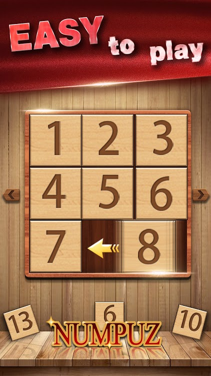
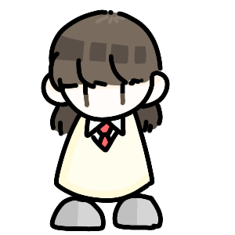
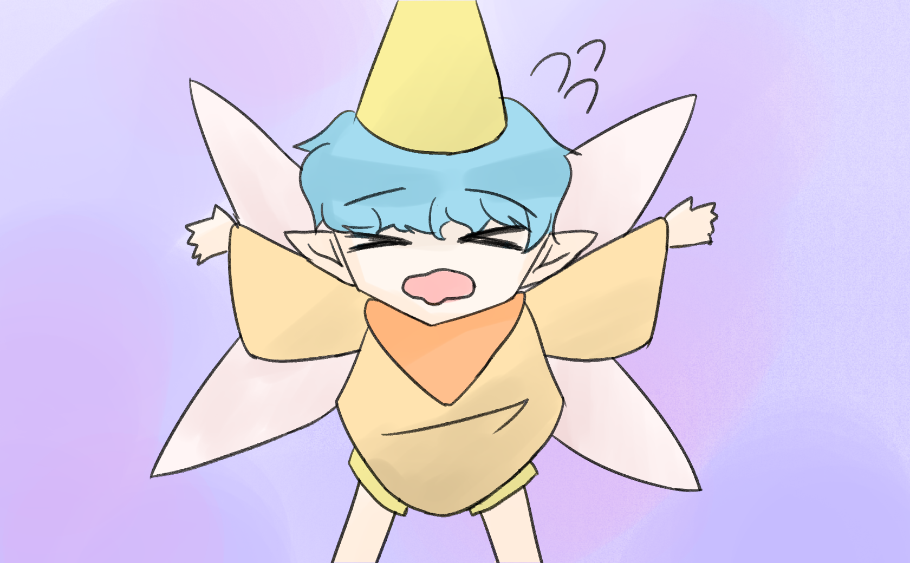

# 아실링의 실수 - 박예솔 & 이지수

> <목차>  

1. [게임명: 아실링의 실수](#아실링의-실수--박예솔--이지수)  

2. [컨셉](#컨셉)  

3. [관련이미지 & 동영상](#관련-동영상--이미지)  

4. [대표이미지](#대표이미지)  

5. [컨셉 & 대표이미지 기반 작품묘사](#컨셉--대표이미지-기반-작품묘사)  

6. [아실링의 실수 구성요소](#게임-구성요소)  

7. [게임 시스템 디자인](#게임-시스템-디자인)  
    - [a. 게임 오브젝트 분해](#구성-요소-분석)  
    - [b. 파라미터(속성)](#파라미터-뽑기)  
    - [c. 행동](#행동-뽑아보기)  
    - [d. 상태](#상태-뽑아-보기)  
    - [e. 플레이어 캐릭터 속성(파라미터)](#플레이어-캐릭터-속성파라미터)  
    - [f. 게임의 규칙](#게임의-규칙)  
    - [g. 게임에서 사용될 공식](#게임에서-사용될-공식)  

8. [개발 요구사항 & 흐름도](#요구사항--흐름도)    
    - [a. 요구사항(12주)](#12주-기준)
    - [b. 요구사항(1년)](#1년-기준)
    - [c. 요구사항(6주)](#6주-기준)
    - [d. 키보드 이벤트에 대한 흐름도](#키보드-이벤트에-대한-흐름도)
    - [e. 용어 정리](#용어-정리)  

9. [개발 작업 일정(6주)](#개발-작업-일정6주)  

10. 방학 전 주차별 동영상  
- [1주차 영상과 작업 결과](https://hawasu.github.io/1주차.html
 "이것은 1주차 영상입니다.")   
- [2주차 영상과 작업 결과 ](https://hawasu.github.io/2주차.html
 "이것은 2주차 영상입니다.") 
- [3주차 영상과 작업 결과 ](https://hawasu.github.io/3주차.html
 "이것은 3주차 영상입니다.") 
- [4주차 영상과 작업 결과 ](https://hawasu.github.io/4주차.html
 "이것은 4주차 영상입니다.")  
- [5주차 영상과 작업 결과 ](https://hawasu.github.io/5주차.html
 "이것은 5주차 영상입니다.") 
 - [6주차 영상과 작업 결과 ](https://hawasu.github.io/6주차.html
 "이것은 6주차 영상입니다.") 

11. 방학 후 주차별 동영상
- 수정 중

  

# [컨셉]

## 메인 컨셉 
> 성취감
- 스테이지 클리어의 목표를 달성하는 것이 목적이다.
- 1인 플레이어 중점.
- 플레이어가 목표 달성 행위 자체에 흥미를 느끼게 함.

 

### 서브 컨셉 1 
> 패턴(반복성)
- 패턴은 퍼즐게임의 특성상 연출의 큰 틀이 된다.
- 일정한 반복은 게임의 정체성을 확립하기에 도움을 준다.

 

### 서브 컨셉 2 
> 규칙성
- 불규칙하거나, 규칙적인 진행 방식으로 반복적인 게임의 지루함을 방지한다.
- 퍼즐 게임의 규칙은 플레이의 가장 큰 도움이 된다.

 

### 서브 컨셉 3 
> 집중력
- 복잡한 퍼즐게임 특성상 문제 해결을 위한 집중력이 발휘되도록 함.
- 흥미를 이끌어내어 게임의 집중을 돕도록 한다.

 

### 서브 컨셉 4 
> 전략적
- 플레이어 스스로 원활한 게임진행을 위해 전략을 세워야 한다.
- 플레이어가 헤메일 수 있도록 경우의 수를 두며 제작해야 함.

 

### 서브 컨셉 5 
> 단계성
- 스테이지 클리어 진행으로 스토리를 쌓아올린다.
- 여러번 반복하며 실력이 늘어난다.

  

# 관련 동영상 & 이미지
>슬라이딩 형식의 게임으로 플레이하는 모습을 대표합니다.

가장 대중적인 슬라이딩 퍼즐 형식입니다.

슬라이드 퍼즐을 이용해 만들어진 게임 Numpuz 입니다. 대부분의 게임 플레이 예시가 들어가 있습니다.

  

# [대표이미지]
## 시작 화면
>시작 화면 세부 설명

- 퍼즐 게임인 만큼 타이틀에 퍼즐들이 있음을 암시하는 그림 배치
- 크게 게임 제목과 가운데 아래에 시작 버튼 설치
- 게임 내부 설정(소리 등)을 바꿀 수 있도록 설정 버튼 배치.

  

# [컨셉 & 대표이미지 기반 작품묘사]

## 스토리- 도입

도서관에서 책을 하나 꺼내 읽음 -> 빛무리가 플레이어를 감싸서 차원의 틈으로 데려감 -> 차원의 틈에서 여러 동화들이 엉망이 된게 보임 -> 작은 빛이 와서 동화가 엉망이 됐으니 도와달라고 불렀다라고 설명 -> 플레이어가 어이없어하다가도 도와주면 집으로 보내준다는 말에 도와준다함 -> 플레이어는 슬라이드 퍼즐을 클리어하며 스테이지를 넘어가 스토리를 진행 함 -> 동화의 결말을 완성시켜 혼란을 잠재우게 됨.

- 혼란을 잠재울 조건: 스테이지 클리어로 인한 진행
- 플레이어가 참여하게 된 이유: 집으로 돌아가고 싶어서
 

>[스테이지]

기준: 동화 한권 -> 월드 하나
설정: 월드 안에 n개의 스테이지가 존재. 스테이지를 모두 클리어 할 시 동화(월드)의 엉망이었던 설정들이 기존에 우리가 알던 이야기로 되돌아옴

## 작품 묘사

---{시작 화면}

도서관에 있는 책을 펼친 모습

---{플레이 화면}

주인공의 상황 - 도서관에서 책을 읽다, 신비로운 힘에 의해 동화속 차원으로 넘어가게 됨.

적 - 없음.

배경 - 도서관에 있는 동화책에 흘려들어가게 되어 시공간에 갇힌 상황
 
---{UI 설명}

- 퍼즐 조각 : 마우스 좌클릭으로 클릭하여 움직일 수 있으며, 퍼즐들을 움직여서 알맞은 자리에 놓아야함.

- 다음 버튼 : 퍼즐 완성시 나오며, 다음 스테이지로 이동 할 수 있음.

- 스테이지 표기 : 현재 위치한 스테이지

[컨셉 기반 작품 묘사]

> (플레이어의 게임 진행 방식)

1. 플레이어의 전체적인 맵 확인 (집중력)
2. 퍼즐 풀이 시작 (규칙적, 전략적)
3. 퍼즐의 완성 (성취감)
4. 다음스테이지로의 이동 (단계성)
5. 이후 반복 (패턴)

  

# [게임 구성요소]
## 메커니즘
> 도전과제

- 책 속을 빠져나가기 위해 퍼즐을 푸는것

> 재미요소

- 같은 스테이지의 퍼즐이라 해도 랜덤하게 퍼즐이 재배치 되어 매번 다른 구조의 퍼즐이 생성됨

## 이야기
> 큰 배경으로는 도서관이 등장하고 동화속으로 플레이어가 흘러들어가 탈출하는 스토리.
동화 속 교훈을 보여주는 것 보다는 플레이어가 무사히 나가는 방향으로 진행.

{스토리- 진행 설명}
- 플레이어는 슬라이드 형식의 퍼즐을 해결하며 스테이지를 넘어가 스토리를 진행함.
- 스토리를 매번 진행하는 것이 아니라 특정 스테이지에 함정과 함께 컷 씬이 존재하여 스토리의 진행을 보여준다.
- 동화는 최대 2개 (신데렐라, 백설 공주)
- 동화 스토리 한개가 끝날때마다 요정(도우미 NPC)를 이용해 다음 동화로 넘어감.

 
{부가 설명}

- 요정 : 동화를 관리하는 관리자, 동화가 서로 충돌을 일으켜서 일부 내용의 손실 및 변형이 일어남. 혼자서 수습이 어려워 플레이어를 끌어들임.
- 혼란을 잠재울 조건 : 스테이지 클리어로 인한 진행
- 플레이어가 참여하게 된 이유 : 갑자기 끌려오게 되어 집으로 갈 수 없어서 집으로 가기 위해.

## 미적 요소
> 1) 디자인

- 기본적으로 동화 내부에 있는 대표적인함 물건들과 창작 요소가 가미된 물건들을 사용하여 동화 같은 느낌과 몽환적인 느낌이 같이 올 수 있도록 디자인 

> 2) 컬러

- 플레이어 - 회색 빛의 색감 (이유: 동화세계와는 다른 세계의 사람이기 때문)
- 그 외의 색감 - 파스텔 톤의 색감. (동화세계 표현)

>3) 음향

- 게임 BGM 전체 통일 : 같은 배경임을 보여줌
- 플레이어의 움직임 : 슬라이드 퍼즐을 옮길 때마다 밀리는 듯한 소리.
- 도달 상황 효과음 : 스테이지 클리어시 축하 해주는 소리.

  

# [게임 시스템 디자인]

## 구성 요소 분석

|오브젝트 번호|오브젝트 이름|오브젝트 이미지|  
| :--------:|:--------:|:--------:|
|1|주인공||
|2|요정||
|6|맵||

  

## 파라미터 뽑기

> 주인공  

|속성|속성 값|설명|비고|  
| :--------:|:--------:|:--------:|:---------:|
|이름|주인공|-|-|
|나이|18|-|-|

 

> 요정  

|속성|속성 값|설명|비고|  
| :--------:|:--------:|:--------:|:---------:|
|이름|아실링|-|-|
|방향성| 길잡이(도우미)| 플레이어의 수월한 스토리 진행을 위한 길잡이 역할|-|

 

> 맵 

|속성|속성 값|설명|비고|  
| :--------:|:--------:|:--------:|:---------:|
|크기|1680 x 1040 pixel| 게임 내 전체 화면 크기|-|
|종료| Stage Fail| 선택지의 점수 합계 < 10,  해당 라운드 통과 실패|-|
|목표|Stage Clear|  선택지의 점수 합계 >= 10 &  해당 라운드 통과|점수에 따라 엔딩이 다름|

  

## 행동 뽑아보기

> 주인공

|행동|설명|  
|:--------:|:------------:|
|대화| 힌트를 위해 아실링과 대화하기 & 스토리 및 동화에 대한 정보 설명|

 

> 요정

|행동|설명|  
|:--------:|:------------:|
|대화| 힌트를 위해 플레이어에게 말걸기 & 스토리 및 동화에 대한 정보 설명|

 

> 퍼즐(1 piece)

|행동|설명|  
|:--------:|:------------:|
|이동| 마우스 클릭으로 이동|

  

## 상태 뽑아 보기

> 주인공

|현상태|전이상태|전이조건|  
|:-------:|:------------:|:----------:|
|등장|대화|플레이어의 현 스토리 클리어|
|대화|퇴장|플레이어의 다음 스토리 진행 시작|

 

>요정

|현상태|전이상태|전이조건|  
|:-------:|:------------:|:----------:|
|등장|대화|플레이어의 현 스토리 클리어|
|대화|퇴장|플레이어의 다음 스토리 진행 시작|

 

>퍼즐 (1 piece)

|현상태|전이상태|전이조건|  
|:-------:|:------------:|:----------:|
|플레이|완성|오리지널 이미지와 퍼즐의 이미지 동일 시|
|플레이|미완성|퍼즐을 완성하지 못한채 버튼으로 넘어갈 때|
|정지|이동|플레이어의 다음 스토리 진행 시작|

  

## 플레이어 캐릭터 속성(파라미터)

 

|속성|영문명칭|설명|비고|  
|:---------------:|:--------:|:-------:|:--------:|
|이동 거리|P| 마우스로 1 piece 씩 이동  모든 piece 동일|-|
|목표|PT| 본 이미지와 똑같이 맞췄을 시 다음 스테이지로의 이동이 일어남  다음 스테이지로 Sceen 넘김|-|

  

## 게임의 규칙

> 핵심 규칙  
1. 클리어 조건으로 정해진 방법 이외의 방법은 없다. 
2. 미완성시 버튼 클릭으로 넘어가기

> 보조 규칙
1. 치트 금지

  

## 게임에서 사용될 공식

1.  
if(완성 된 퍼즐 배열(0~7) '==' 랜덤 됨 퍼즐 배열(0~7))  
	성공 텍스트 출력 및 씬 이동  
else if(퍼즐 실행 후 n초 후)  
	스킵 버튼 등장  
	클릭 시 씬 이동  

  

# [요구사항 & 흐름도] 

## (12주 기준) - 1년 기준에서 수정 된 부분만 작성
### - <그래픽>
1. 인게임 내 퍼즐 그림
- 신데렐라  
신데렐라가 집안일을 하는 모습 
새엄마가 신데렐라를 괴롭히는 모습 
왕자와 무도회장의 모습 
유리구두를 실수로 놓고가는 모습 

- 백설공주 
새엄마가 백설공주를 싫어하는 모습 
난쟁이가 백설공주를 가여워 하는 모습 
왕자가 백설공주와 함께 가는 모습 

2. 엔딩 화면 
스테이지 클리어 시 축하합니다! 문구와 같이 축하하는 이미지 제작 
게임오버시 GAME OVER 문구와 같이 좌절하는 이미지 제작 

### - <프로그래밍>

  
## (1년 기준) -방학 이후 계획 수정 

### - <그래픽>

1년 계획

) 

### - <그래픽>
 
 1. 중반 스토리  
- 첫번째 동화 - 신데렐라
    - 신데렐라가 신데렐라라는 이름을 받지 않아 집안일을 하지 않고 있는 화면
    - 새엄마가 신데렐라에게 잘해주는 모습
    - 왕자가 무도회를 거부하는 모습
    - 무도회에서 유리구두를 실수로 놓고가는 일이 없는 모습.

- 두번째 동화 - 백설공주
    - 추후 이야기 각색 완료 후 포인트 화면 결정

- 세번째 동화 - 개구리 왕자
    - 추후 이야기 각색 완료 후 포인트 화면 결정

 

2. 후반 스토리
- 동화가 모두 안정화가 되는 모습
- 아실링이 플레이어에게 감사인사를 하는 모습
- 플레이어가 집으로 돌아가기 위해 아실링이 마법을 쓰는 모습
- 플레이어가 다시 도서관으로 돌아온 모습
- 이후 도서관을 나와 집으로 돌아가는 모습

 

3. 엔딩 화면
- 스테이지 클리어시 축하합니다! 문구와 같이 축하하는 이미지 제작
- 게임 오버시 GAME OVER 문구와 같이 좌절하는 이미지 제작

 

### - <프로그래밍>
1. 시작화면, 게임화면, 스토리화면, 엔딩화면 총 4개의 화면으로 구성된다.

 

2. 시작화면
- 시작화면에는 시작하기, 종료하기, 옵션 버튼이 들어간다.
- 시작하기 버튼은 중앙 하단에 위치하며 종료하기 버튼은 시작하기 버튼 아래에 위치한다.
- 옵션 버튼은 우측 상단에 들어간다.
    - 옵션 , 나타내기와 돌아가기 Esc 이용  
    -> 화면 구성 (볼륨 조절, 제작자 및 출저 확인, 저장하기-저장 후 종료를 하면 게임을 나중에 켰을 때 저장된 부분부터 시작)
    
 

3. 게임화면
- 게임화면에서 다시하기 버튼, 옵션 버튼, 체력 ui, 현재 스테이지 ui가 표시된다.
    - 기능 구현 >> 다시하기 버튼(온클릭시 현 스테이지 재시작),  
    옵션 버튼(시작화면과 동일),  
    체력 & 현재 스테이지 (이동횟수와 현재 스테이지 텍스트로 표현)
- 다시하기 버튼과 옵션 버튼은 좌측 상단에 위치, 체력 ui는 좌측 하단에 위치, 현재 스테이지 ui는 우측 하단에 위치한다.
- 주어진 맵 크기에 미리 정해둔 위치에 블록을 생성해준다.
    - 타일 맵을 이용 
- 동화마다 레벨이 정해져 퍼즐의 난이도가 상승하나 따로 ui 표시는 하지 않는다.
- 스테이지 클리어 조건은 캐릭터가 포탈에 도달하는 것이다.
- 조작은 키보드(WASD, 방향키)로 캐릭터의 동서남북 방향과 걷기 동작을 애니메이션 구현한다.
- 키보드(SPACEBAR)로 상자 오브젝트에 대한 행동을 구현한다.
    - 질질 끄는 것이 아닌 힘을 가해서 1칸씩 밀리는 것으로 재구성
- 맵 구현 기능
    - 타일 맵을 이용한 새로운 구조를 구상 및 코딩 수정
- 게임 화면을 오브젝트의 태그를 개수를 증가시켜 하나의 씬 구성으로 해결한다.
    - 현재 게임 화면의 수정 포함
    
 

4. 스토리화면
- 스토리 화면은 시작, 초반, 중반, 후반으로 나뉜다.
- 모든 스토리 화면에 우측 하단에는 Next 버튼이 표시된다.
- Next 버튼으로 텍스트와 이미지를 넘길 수 있다.
- 스토리 초반에 개별 UI와 그 안에 텍스트가 나타난다.
- 이미지 화면은 전체적으로 스토리가 진행되면서 스크립트 형식으로 나온다.
- 스토리 중반, 동화의 마지막 스테이지 클리어 후 수정된 동화의 이야기를 정리하는 화면이 나타난다.
- 이야기 정리 화면은 게임화면 전체를 쓰지 않고 가로X세로 각각 0.5배의 크기를 가진다.
- 동화는 3가지 이고 동화 한 편당 스테이지는 총 4개이다.
- 스토리 화면의 초반, 중반 부분을 오브젝트의 태그의 개수를 증가시켜 하나의 씬 구성으로 해결한다.
- '백설공주'와 '개구리왕자' 이야기 각색

 

5. 엔딩화면
- 엔딩화면의 게임오버, 탈출로 나뉜다.
- 게임 오버 화면에서는 다시하기 버튼과 나가기 버튼이 표시된다.
- 다시하기 버튼과 나가기 버튼은 중앙하단에 위차한다.
- 나가기 버튼은 시작화면으로 다시하기 버튼은 해당 스테이지 첫 부분으로 이동된다.
- 탈출 화면은 모든 스토리를 정리하여 그림 스크립트 형식으로 표시된다.
- 탈출 화면에서는 돌아가기 버튼이 표시된다.
- 돌아가기 버튼은 정중앙에 위치하며 마우스 좌클릭시 시작화면으로 이동된다.

 

6. 효과음
- 배경음 찾기 및 적용 (시작 게임 엔딩)
- 효과음 찾기 및 적용 (박스, 버튼, 함정, 포탈)

  

6주 기준

#### - ~~1. 시작화면, 게임화면, 스토리화면, 엔딩화면 총 4개의 화면으로 구성된다.~~  
 

#### - ~~2. 시작화면~~
- ~~시작화면에는 시작하기 버튼이 들어간다.~~  
- ~~시작하기 버튼은 중앙 하단에 위치한다.~~  
 

#### - 3. 게임화면
- ~~게임화면에서 다시하기 버튼, 체력 ui가 표시된다.~~ 
- ~~다시하기 버튼은 좌측 상단에 위치, 체력 ui는 좌측 하단에 위치에 위치한다.~~
- ~~주어진 맵 크기에 미리 정해둔 위치에 블록을 생성해준다.~~
- ~~스테이지 클리어 조건은 캐릭터가 포탈에 도달하는 것이다.~~
- ~~조작은 키보드(WASD)로 캐릭터의 동서남북 방향과 걷기 동작을 구현한다.~~  
- ~~키보드(SPACEBAR)로 상자 오브젝트에 대한 행동을 구현한다.~~  
- ~~(6주 한정)함정 시스템 리메이크/ 도달시 미니게임 등장 -> 도달시 베드엔딩으로 넘어감~~  
- ~~맵 구현 리메이크~~   
~~::타일을 이용한 맵 구현 -> 오브젝트를 이용한 맵 구현~~  
~~::소코반 퍼즐의 최소 움직임을 위한 맵 구현~~
 

#### - 4. 스토리화면  
- ~~스토리 화면에는 개별 UI와 그 안에 텍스트가 나타난다.~~  
- ~~동화는 1가지 이고 스테이지는 총 4개이다.~~  
- ~~텍스트 박스 내 우측 하단에 skip버튼 생성~~  
- ~~skip버튼 구현  
(이미지 연속적인 넘김, 텍스트 넘김, 스토리 -> 게임 씬 넘김)~~  
- ~~스토리 화면의 갯수
(초기 - 8개 / 배경 스토리 및 플레이 시작 설명, 중기 - 최소 4개 / 스토리의 구분 점 변경으로 수정 가능)~~

 

#### - ~~5. 엔딩화면~~  
- ~~엔딩화면의 게임오버, 탈출로 나뉜다.~~  
- ~~게임 오버 화면에서는 다시하기 버튼과 나가기 버튼이 표시된다.~~  
- ~~다시하기 버튼과 나가기 버튼은 중앙하단에 위차한다.~~  
- ~~나가기 버튼은 시작화면으로 다시하기 버튼은 해당 스테이지 첫 부분으로 이동된다.~~  
- ~~탈출 화면에서는 돌아가기 버튼과 클리어 축하 ui가 표시된다.~~  
- ~~돌아가기 버튼은 ui 아래 정중앙에 위치한다.~~  

 

#### -6. 효과음

- ~~배경음 찾기 및 적용 (시작 게임 엔딩)~~  
- 효과음 찾기 및 적용 (박스, 버튼, 함정, 포탈)  

  

## [키보드 이벤트에 대한 흐름도]

  

## [용어 정리]

  

## [개발 작업 일정(6주)]

 

> 설명  

>> 프로그래밍  

- 메뉴 - 2(1,2)  
: 시작화면 구성(옵션 기능 및 버튼 -> 옵션 기능 제거)  
 
- 플레이어 - 3(4,5)  
: 플레이어의 클리어 조건 설정 및 동작 구현  
 
- 충돌 - 3(6)  
: 상자 오브젝트에 대한 충돌 이벤트 구현  
 
- 맵 - 3(3,4)  
: 맵 생성 및 클리어 조건에 대한 구조 설정  
 
- 스토리 설정 - 4(2)  
: 동화의 스토리 각색  
 
- 스크립트 - 4(1)  
: 스토리 ui 텍스트 출력 구현  
 
- GUI - 2(1),3(1,2),5(2,3,4,5,6)  
: 버튼 및 ui 기능 구현  
 

>> 그래픽  

- 메인메뉴 - 4(1)  
: 텍스트 박스 생성  
 
- 맵 - 4(1)  
: 맵 생성  
 
- 캐릭터 - 3(4,5)  
: 캐릭터의 동작 이미지 제작  
 
- 오브젝트 - 3(6)  
: 상자 오브젝트 제작  
 
- 배경화면 - 1, 4(1), 5  
: 시작화면, 스토리화면, 엔딩화면 제작  
 
- GUI - 3(1)  
: 게임화면의 ui 제작  

  
